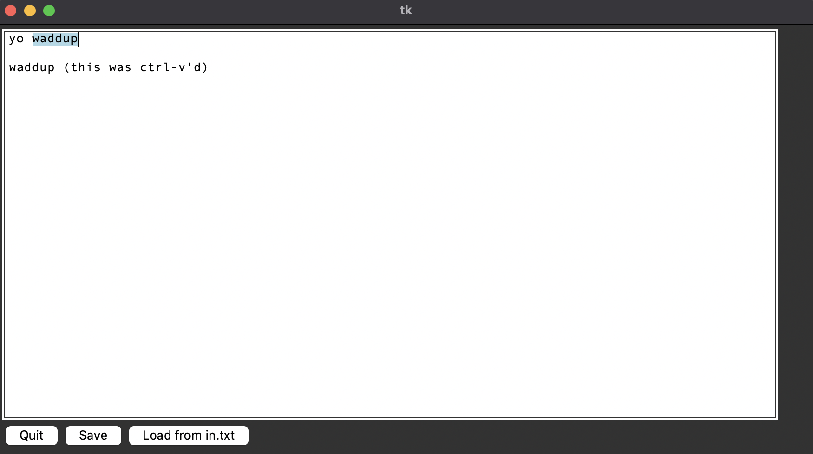

# textedit

A little fun project. In the end, this will be a basic text editor without anything fancy. It can save and load files, that's it. Maybe I'll add some syntax highlighting. Goal is to have a working editor after 24 work hours and then be done with the project. I'll add as many [features](features.md) as I can in that time frame.

## Current State

## Time worked:

| Date | Hours | Changes  |
| ------ | ------ | --- |
| 2023/08/30 | 2 | Drawing the text box, cursor can move in a grid, implemented some rope operations
| 2023/08/31 | 1 | Return / delete mechanics, primitive save
| 2023/09/01 | 2 | Implemented some more rope operations, cursor teleport, primitive load, TAB key support
| 2023/09/02 | 3 | Copy/paste support, text marking (across multiple lines, with cursor) |